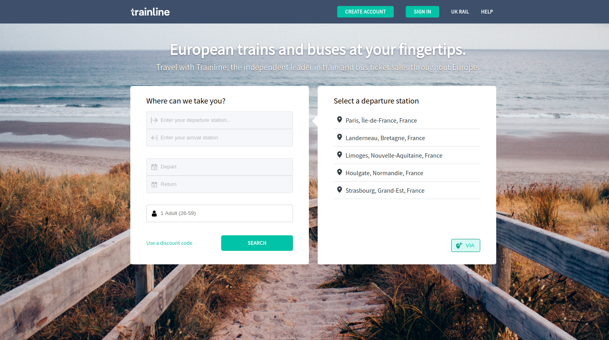
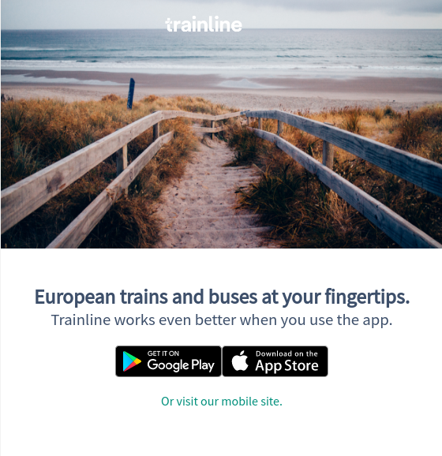

# Project Test

## Front copying from [TrainLine](https://www.trainline.eu/)
## Back Api from  Tictactrip
* http://www-uat.tictactrip.eu/api/cities/autocomplete/?q=P
* http://www-uat.tictactrip.eu/api/cities/popular/5
* http://www-uat.tictactrip.eu/api/cities/popular/from/puteaux/5

### Technical Stack
* Axios
* React.js
* Sass/Scss

### Project Init
* git clone
* npm install

### Site déployé sur Heroku
[Lien du site](https://secret-chamber-39747.herokuapp.com/)

# À améliorer :
* Refactoring des composants enfants / parents (reactJS)
* Merger Fonctions choosePlace() et handleClickBtn()
* Découper App.scss en différentes feuilles de style par composant
* Implémenter Redux
* Query de l'API avec le params ?q= cf : getQueryDest() à appliquer à la recherche de stations d'arrivée
